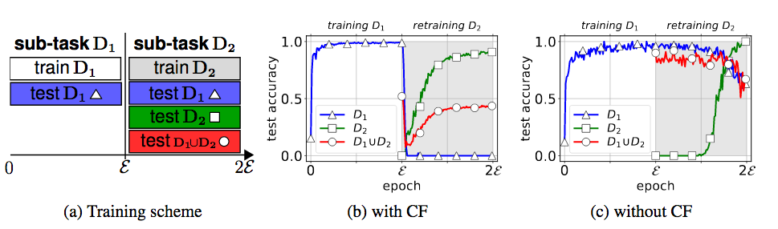
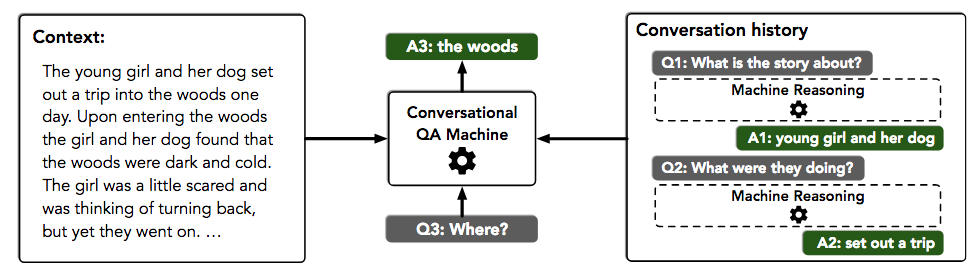
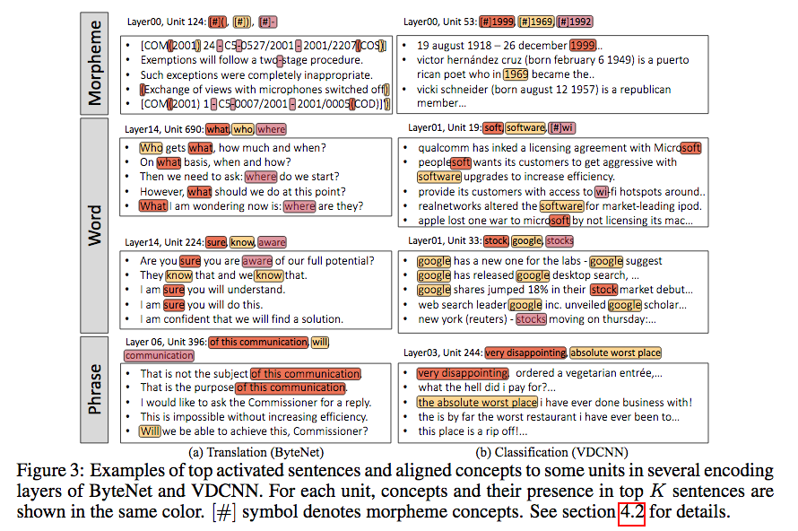
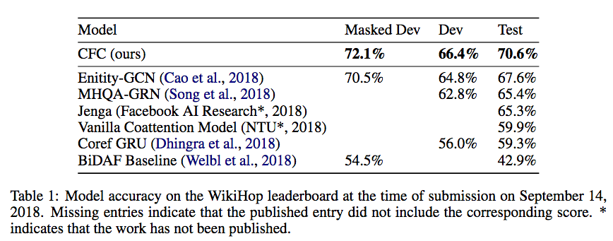
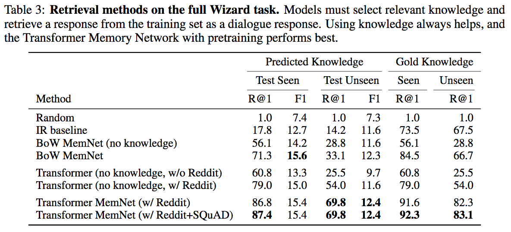
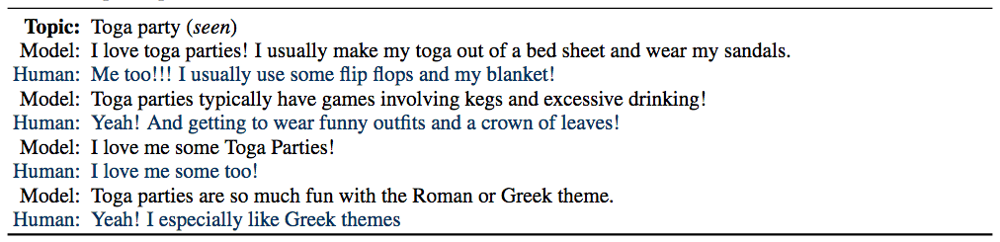
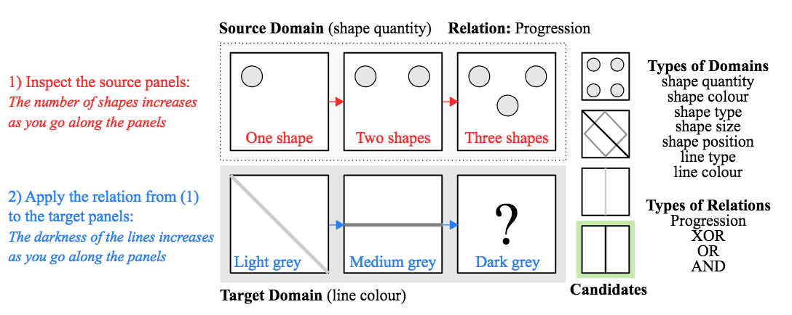

Browsing through the accepted papers of ICLR 2019 (the conference takes place in May 2019, the notifications came out around Christmas 2018) a few works stood out to me as an IR researcher - the list is below. Compared to the previous years, my impression is that the number of NLP works are decreasing, at least among the accepted works. According to [this source](https://github.com/lixin4ever/Conference-Acceptance-Rate), the ICLR acceptance rate this year is 31%: 500 out of 1591 papers were accepted and 24 of those were given oral presentation spots, the remaining 476 will be presented as posters. As it is quite easy to overlook something when browsing 500 paper titles/abstracts, take this list with a grain of salt!

Besides that, the open review model also led to some [Twitter soul searching](https://twitter.com/riceasphait/status/1087433052807139328) over [decisions](https://openreview.net/forum?id=rJlWOj0qF7).

The [ICLR Reproducbility Challenge](https://github.com/reproducibility-challenge/iclr_2019) is worth taking a look too, especially in terms of the GitHub setup - student groups in deep learning courses across the world tried their luck at reproducing papers. So far it looks like that the vast majority of reproduction attempts (more than 100) are still in progress. 

The move away from the two conference and workshop tracks (and shuffling of papers that just did not make the conference track to the workshop track) that [past ICLR editions](https://openreview.net/group?id=ICLR.cc) had is off the table this year. When I was at [ICLR 2017](https://chauff.github.io/2017-04-25-iclr2017/) I definitely gained more from the more applied workshop track papers than the conference ones. Now the setup is more traditional, a single conference track and a number of workshops running alongside the conference.

The [ICLR2019 Open Review Explorer](https://chillee.github.io/OpenReviewExplorer/) makes it easy to find the top-rated papers. Most of the ones I mention here are in the middle and towards the lower end of the acceptance threshold (because the best NLP papers still go to other venues?).

Let's talk papers ... :point_down:

1. [No Training Required: Exploring Random Encoders for Sentence Classification](https://openreview.net/forum?id=BkgPajAcY7). The authors have a clear motivation for their work: *"it is unclear how much trained sentence-encoding architectures improve over the raw word embeddings, and what aspect of such architectures is responsible for any improvement"*. To gain a better understanding of the empirical performance of sentence embeddings the authors ask the following: *"given a set of word embeddings, how can we maximize classification accuracy on the transfer tasks WITHOUT any training?"* It turns out that random parametrizations go a long way once a fair manner of comparison is established. The authors include a few critical remarks in their article, including *"baselines need more love"* and *"... such in-full comparisons are simply not feasible, and often not appreciated by reviewers anyway"*.

2. [A comprehensive, application-oriented study of catastrophic forgetting in DNNs](https://openreview.net/forum?id=BkloRs0qK7) The paper empirically shows that catastrophic forgetting (CF) is still a huge issue in incrementally trained deep neural nets, despite claims in prior works to the contrary. Instead of being trained once on a single task, in practice training successively on two or more sub-tasks is common. An issue in incremental learning is catastrophic forgetting: once training on a new sub-task begins, almost all knowledge stored in the model about previous sub-tasks is lost (the figuure :point_down: showcases forgetting vs. not forgetting). The authors point out a number of characteristics that incremental learning exhibits _in practical applications_ such as a low memory footprint that prior proposals to solving catastrophic forgetting have not considered.

   
3. [Generative Question Answering: Learning to Answer the Whole Question](https://openreview.net/forum?id=Bkx0RjA9tX) Question answering has been a popular challenge for NLP researchers. Most models are discriminative in nature. Here, the authors argue that discriminative models can easily overfit to biases in datasets (as also shown in some of the adversarial work in NLP). To overcome this issue, the authors introduce generative models of the joint distribution of questions and answers, testing their approach on the [CLEVR](https://cs.stanford.edu/people/jcjohns/clevr/) (visual question answering) and [SQuAD](https://rajpurkar.github.io/SQuAD-explorer/) datasets. While the empirical results are not necessarily (much) better than prior works, this is a novel approach that deserves publication, as pointed out by Reviewer 2: _I feel pretty strongly that this paper should be accepted.  We should not be fixating on leaderboard performance numbers and blackbox comparisons.  Science is much more broad than "who has the best experimental result". The presented method in the paper works well, it's a very interesting, novel idea, and the paper is well written._

4. [Efficient Multi-Objective Neural Architecture Search via Lamarckian Evolution](https://openreview.net/forum?id=ByME42AqK7) Architecture search, i.e. the automatic generation and evaluation of many neural architectures in order to find a good one, is the new feature engineering (to me). This paper tackles one of the main issues architecture search faces: the need for an almost endless number of GPUs. The authors propose LEMONADE, a multi-objective evolutionary algorithm for architecture search. It is fast (well, fast for neural architecture search approaches): _[...] allows finding models that are on par or even outperform different-sized NASNets, MobileNets, MobileNets V2 and Wide Residual Networks on CIFAR-10 and ImageNet64x64 **within only one week on eight GPUs**, which is about **20-40x less compute power** than previous architecture search methods that yield state-of-the-art performance._

5. [FlowQA: Grasping Flow in History for Conversational Machine Comprehension](https://openreview.net/forum?id=ByftGnR9KX) This paper is based on an intuitive motivation: in order to conduct conversational reading comprehension well (in contrast to single-turn reading comprehension), the conversation history needs to be taken into account (as easily seen in the authors' motivating example :point_down:). The authors _introduce FLOW, a mechanism that can incorporate intermediate  representations generated during the process of answering previous questions, through an alternating parallel processing structure. Compared to shallow approaches that concatenate previous questions/answers as input, FLOW integrates the latent semantics of the conversation history more deeply._ The experiments on two recent and hot conversational datasets ([CoQA](https://stanfordnlp.github.io/coqa/) and [QuAC](https://quac.ai/)) show substantial improvements over very competitive baselines. Definitely worth looking at for conversational question answering! We covered this paper a few weeks ago in our reading group and we puzzled more than an hour about what exactly the authors' _flow_ concept refers to (as also noted by at least one reviewer). 

2. [Understanding Composition of Word Embeddings via Tensor Decomposition](https://openreview.net/forum?id=H1eqjiCctX) A theoretical work on word embeddings that I am still trying to process, but great to see an approach (embeddings) that has been written about and analyzed over and over to still yield new insights!
      
3.  [Analysing Mathematical Reasoning Abilities of Neural Models](https://openreview.net/forum?id=H1gR5iR5FX) Who wouldn't want a neural net that solves the tedious high-school maths exercises? This paper goes into this direction: presented is a dataset (:point_down: check out the examples from the paper) and a suite of neural models together with an analyses of their shortcomings for this task. Instead of gathering question examples from actual textbooks, the authors generated their dataset according to the material taught in high school, yielding millions of generated training examples. Neural nets found the following question types easy to deal with: _[...] finding the place value in a number, and rounding decimals and integers, which all models got nearly perfect scores on. Questions involving comparisons also tended to be quite easy._ In contrast, neural nets had difficulty with  number-theoretic questions (primality, factorization). 

    
13. [Multi-step Retriever-Reader Interaction for Scalable Open-domain Question Answering](https://openreview.net/forum?id=HkfPSh05K7) Open-domain question answering is a popular NLP task. It typically consists of two steps: given a question (a _query_), first retrieve a set of paragraphs that are likely to contain the answer (this is where IR should shine, but typically this is relegated to be some tf.idf variant) and then run a machine reading comprehension algorithm to determine the answer within the top-retrieved paragraph(s). [DrQA](https://github.com/facebookresearch/DrQA) is the most popular baseline for this task. Here, the authors go beyond the usual pipeline and create an architecture in which the retriever and reader _iteratively_ interact with each other. This is a query refinement setup: the initial query is reformulated based on the reading comprehension model, a new retrieval round starts with the refined query and on it goes. What I like particuarly about this paper are the many analyses conducted (in response to reviewers' comments) - it is not just a new pipeline, that beats prior works (of course!), but the authors also look at many different angles to explore the benefits and issues of their pipeline. The source code is not yet available but that's another nice detail about openreview.net - interested researchers can publicly bug the authors about the promised goods!

14. [Discovery of natural language concepts in individual units](https://openreview.net/forum?id=S1EERs09YQ) Neural nets for NLP tasks are considered much more of a black box than neural nets for vision tasks, as in the latter case we have a good idea of how to determine what different layers encode (we know that some layers focus on edges, some color contrasts and so on). For NLP tasks such visualizations are harder to come by and it is not even clear whether we can find interpretable patterns encoded in particular layers. Here, the authors introduce a technique to determine which fundamental building blocks of natural language (morphemes, words, phrases) different units of character-level CNNs encode. The setup is agnostic of the specific task(s) the neural net has been trained on. The result looks like this :point_down:. The main finding is that indeed units of the hidden layers serve as detectors of natural language concepts instead of uninterpretable patterns. 

15. [Building Dynamic Knowledge Graphs from Text using Machine Reading Comprehension](https://openreview.net/forum?id=S1lhbnRqF7) This paper tackles an interesting task: tracking the state changes of entities on a per-sentence level in procedural text. The [ProPara](http://data.allenai.org/propara/) dataset was the authors' main empirical target - it requires algoritms to identify actions and track the state changes of the involved entities. Here :point_down: is a concrete example from the ProPara website. The paper shows off how much engineering and reworking of existing models is required to pull off a good performance on this task. It is also a task that is far from being solved (i.e. we are still a long way off from the human performance levels). 

16. [Representation Degeneration Problem in Training Natural Language Generation Models](https://openreview.net/forum?id=SkEYojRqtm) Here, the authors take an empirical observation that is undesired (namely that the training of natural language generation models leads to word embddings which are distributed in a narrow subspace), hypothesize about reasons for the behaviour and then "fix" the issue by a novel regularization approach. I like the mix of theoretical and empirical work in this one!

17. [Coarse-grain Fine-grain Coattention Network for Multi-evidence Question Answering](https://openreview.net/forum?id=Syl7OsRqY7) is for me a prototypical ICLR paper. It contains experiments on two _very_ recent datasets ([Qangaroo WikiHop](https://qangaroo.cs.ucl.ac.uk/) and [TrivaQA](http://nlp.cs.washington.edu/triviaqa/)) that pose challenging question answering tasks which require reasoning over several evidence documents. The introduced model (which once more makes good use of the task knowledge) is state-of-the-art as of September 14, 2018 as seen in this result table :point_down::  

18. [Wizard of Wikipedia: Knowledge-Powered Conversational Agents](https://openreview.net/forum?id=r1l73iRqKm) One of the main issues in the current quest for intelligent open-domain dialogue agents is the lack of high-quality and large-scale training data. This paper describes the collection of such a dataset as well as a number of high-quality end-to-end trained dialogue models. The authors have collected 22,311 conversations *grounded with Wikipedia knowledge* with on average 9 turns, on more than 1000 topics (here: a topic is a Wikipedia article). Each dialogue was created by two participants (crowd-workers) who engaged in chit-chat and had distinct roles: one played the role of a knowledgeable expert (the *wizard*) while the other was a learner. The wizard *has access to an information retrieval system that shows them paragraphs from Wikipedia possibly relevant to the conversation, which are unobserved by the apprentice. Before each conversation turn the wizard can read these paragraphs and then potentially base their next reply on that observed knowledge.* The presented models (retrieval-based and generative) replace the wizard in the conversation. The retrieval-based approaches (i.e. the retrieval of a valid response from the training data set) work outperform the generation approaches:

Once more, IR is considered as pretty much useless, the IR baseline in the table :point_up: is just described as *a [..] baseline, which uses simple word overlap*. IR can definitely do better. 
Lastly, here :point_down: is an interesting conversation between a retrieval-based model and a human about [toga parties](https://en.wikipedia.org/wiki/Toga_party). Not much learning going on, but a lot of love for toga parties. There are probably many interesting conversations in the training dataset, available at [http://www.parl.ai/](http://www.parl.ai/).

19. [GLUE: A Multi-Task Benchmark and Analysis Platform for Natural Language Understanding](https://openreview.net/forum?id=rJ4km2R5t7) This paper introduces a benchmark that contains a suite of tasks for natural language understanding, comes with a [leaderboard](https://gluebenchmark.com/leaderboard) and a host of good-quality baselines. As leaderboards in the NLP context typically mean a hidden test set to avoid overfitting (which makes an error analysis and a fine-grained comparison between approaches that goes beyond *my number is higher than your number* impossible), the authors introduce an additional [diagnostic dataset](https://gluebenchmark.com/diagnostics). Every time I see a paper like this, I want to see a similar effort in IR. But sadly, IR conferences are not yet at a stage where dataset/benchmark papers come through easily. 

20. [Learning to Represent Edits](https://openreview.net/forum?id=BJl6AjC5F7) is an allrounder paper, presenting a task (*learn to represent the salient information of an edit and [use it] to apply edits to new inputs*), a public dataset and a number of neural baselines applied to natural language and source code edit data. The paper could have also easily fit into EMNLP or ICSE (the *International Conference on Software Engineering*) instead. What I really like here though is the writeup, and the way domain knowledge is cleverly encoded. A point to nag about is the IR baseline they employ: TF.IDF. There are better non-neural ways to compute the semantic similarity between short pieces of text. 

21. [Ordered Neurons: Integrating Tree Structures into Recurrent Neural Networks](https://openreview.net/forum?id=B1l6qiR5F7) Let me quote the meta-reviewer: *This paper presents a substantially new way of introducing a syntax-oriented inductive bias into sentence-level models for NLP without explicitly injecting linguistic knowledge. This is a major topic of research in representation learning for NLP, so to see something genuinely original work well is significant. All three reviewers were impressed by the breadth of the experiments and by the results, and this will clearly be among the more ambitious papers presented at this conference.* The authors revise the vanilla RNN model to incorporate syntax information in a clever way - based on a simple observation (*In general, natural language is governed by a tree structure:  smaller units (e.g., phrases) are nested within larger units (e.g., clauses).*) and a change of one of the RNN update functions. 

22. [Learning to Make Analogies by Contrasting Abstract Relational Structure](https://openreview.net/forum?id=SylLYsCcFm) This is great paper that takes a specific cognitive process (visual analogical reasoning) and explores to what extent neural nets are able to learn and reason about visual raw data. The figure below (from the paper) shows off what analogical reasoning entails and how the authors frame the problem. The key finding here is that not the neural architecture is of importance, but the clever selection of training data. Having such a concise problem and creating a corresponding dataset to investigate neural nets' ability to cope with the problem is something that is largely absent in IR. There are no small concise problems (or at least we don't consider IR tasks in this way) and so such precise diagnostics are hard to come by.

